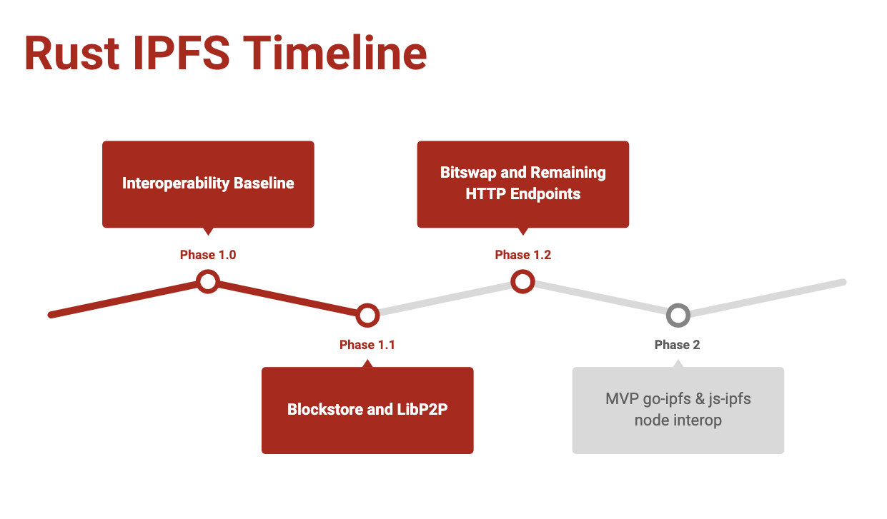

Calling all rustaceans, rustafarians, ferrosities, and rustlers - we’ve got an exciting update!
Active full time work on a Rust-IPFS implementation has commenced, building on the great work by
[Parity](https://www.parity.io/) in `rust-libp2p`. [Equilbrium](https://equilibrium.co) is spearheading the new community and
implementation with support from Protocol Labs, and is looking for additional Rust devs itching
to help build a new language implementation of the InterPlanetary File System combining the
performance and resource utilization benefits of Rust with a keen eye on conformance to the IPFS spec. Read more on the [Equilibrium Labs blog](https://medium.com/equilibriumco/rust-ipfs-our-plan-of-attack-af8358f90beb)!

## Why Rust IPFS? Why Now?

Rust, the programming language, has enjoyed a recent spike in popularity. This is due both to its
inclusive community, and also being a safe systems language with performance comparable to C and
C++. An IPFS implementation written in Rust only makes sense. Additionally, the community has been
[asking for a while now](https://github.com/ipfs/notes/issues/363), for a number of use cases:

1. Usage in resource-constrained systems such as Industrial Internet-of-Things (IIoT) controllers
2. Portability of certain subsets of the IPFS stack into WebAssembly
3. Usage of IPFS functionality and APIs via native Rust function calls via inclusion as a Rust crate.

Given that, it's no surprise that Rust-IPFS was also one of the [IPFS 2020 Theme Proposals](https://github.com/ipfs/roadmap/issues/54) suggested in our community-driven [IPFS 2020 Roadmapping Process](https://github.com/ipfs/roadmap/blob/master/2020-IPFS-Project-Planning.md) - and that the community quickly rose to the challenge. Equilibrium, an active participant in many dweb infrastructure projects, stepped up to take on core implementation and stewardship of this new language implementation, with support through the [new IPFS DevGrants program](https://github.com/ipfs/devgrants) to provide coordination and maintainership for passionate developers in the wider Rust community.

With both community demand and active participation, the time was ripe for the Rust-IPFS effort to be revitalized and reborn!

## Leveraging Community Efforts

The IPFS community is a talented group of people with an impressive array of high quality work in the Rust space already. There's the aforementioned
[rust-libp2p](https://github.com/libp2p/rust-libp2p), which is already used by the likes of Polkadot, Substrate, and Lighthouse; there's ferrismtg's [rust-ipfs-api](https://github.com/ferristseng/rust-ipfs-api) which is already doing wonders in providing a bridge from the Rust world; and of course [David Craven](https://github.com/dvc94ch)'s [rust-ipfs](https://github.com/rs-ipfs/rust-ipfs), which is the foundational work behind this latest endeavor.

Instead of forking and/or starting fresh, this project aims to support and build on the impressive amount of progress that's already been made, helping carry the torch across the finish line while _incorporating_ and _including_ the community of passionate Rust contributors in the process.

## What can be expected, and when?

As you can see in the [Rust-IPFS DevGrant Roadmap](https://github.com/ipfs/devgrants/tree/master/open-grants/ipfs-rust) implementation work
takes place mostly over early Q2 2020 and covers the use case of **IPLD applications**,
targeting the low-level blockstore, libp2p integration, and IPLD-related functionality
such as `ipfs dag put` and `ipfs dag get`.

To learn more about the effort, you can:

1. Visit the [rs-ipfs organization](https://github.com/orgs/rs-ipfs) on GitHub
2. Read more about this effort on the [Equilibrium Labs blog](https://medium.com/equilibriumco/rust-ipfs-our-plan-of-attack-af8358f90beb)

## You can help!

Community participation in making Rust-IPFS a reality is encouraged and welcomed! If you
want to pitch in, here are a few ways:

1. Star and watch the [GitHub repo](https://github.com/rs-ipfs/rust-ipfs)
2. Take on the development efforts associated with IPFS APIs [deemed out of scope for the initial grant milestones](https://github.com/rs-ipfs/ipfs-rust-conformance/issues?q=is%3Aopen+is%3Aissue+label%3A%22help+wanted%22)
3. Look for `help-wanted` issues that are marked as [needing help from the community](https://github.com/rs-ipfs/rust-ipfs/issues?q=is%3Aissue+is%3Aopen+label%3A%22help+wanted%22)
4. Back IPFS Rust on [OpenCollective](https://opencollective.com/ipfs-rust)
